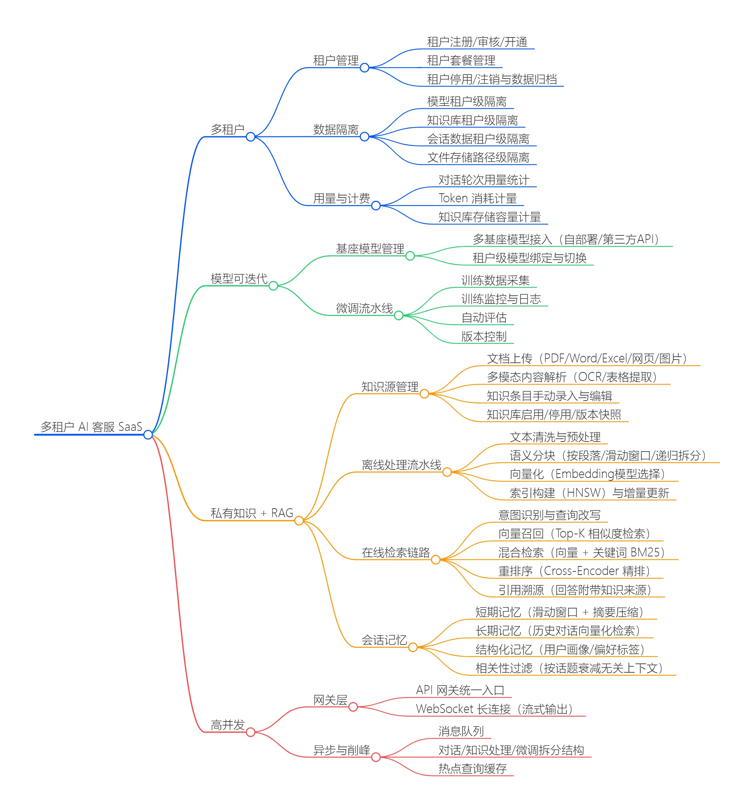
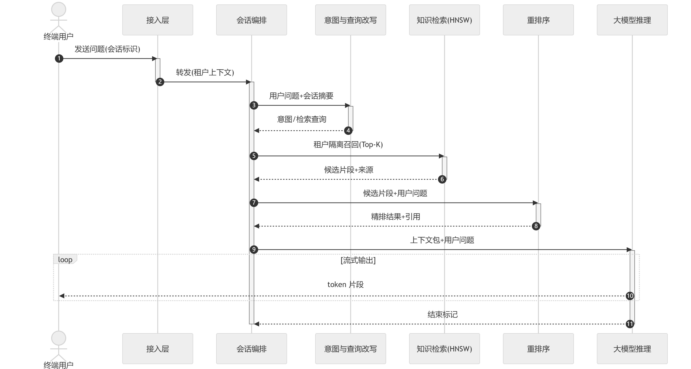
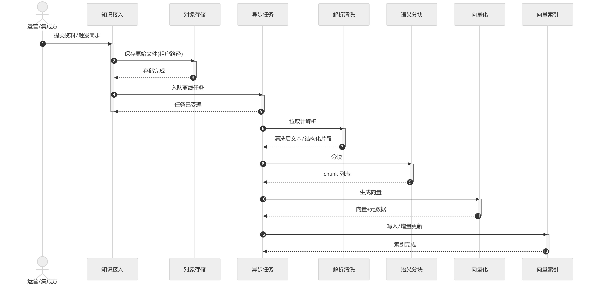
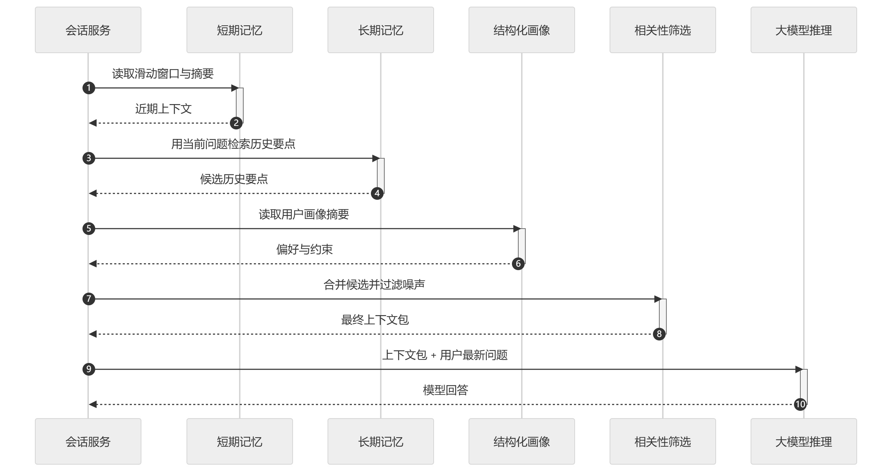
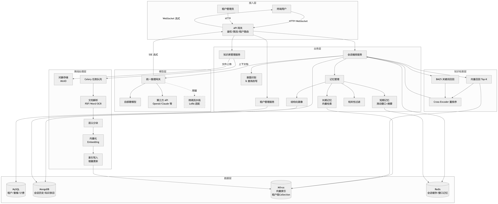

# 多租户 AI 客服 SaaS（设计说明）

1. 业务目标：设计一个支持多租户的AI客服SaaS系统，要求能够支持模型迭代微调，私有知识库上传（RAG），保证数据隔离，并能应对高并发。
2. 需求梳理：

markmap
# 多租户 AI 客服 SaaS
- 多租户
    - 租户管理
        - 租户注册/审核/开通
        - 租户套餐管理
        - 租户停用/注销与数据归档
    - 数据隔离
        - 模型租户级隔离
        - 知识库租户级隔离
        - 会话数据租户级隔离
        - 文件存储路径级隔离
    - 用量与计费
        - 对话轮次用量统计
        - Token 消耗计量
        - 知识库存储容量计量
- 模型可迭代
    - 基座模型管理
        - 多基座模型接入（自部署/第三方API）
        - 租户级模型绑定与切换
    - 微调流水线
        - 训练数据采集
        - 训练监控与日志
        - 自动评估
        - 版本控制
- 私有知识 + RAG
    - 知识源管理
        - 文档上传（PDF/Word/Excel/网页/图片）
        - 多模态内容解析（OCR/表格提取）
        - 知识条目手动录入与编辑
        - 知识库启用/停用/版本快照
    - 离线处理流水线
        - 文本清洗与预处理
        - 语义分块（按段落/滑动窗口/递归拆分）
        - 向量化（Embedding模型选择）
        - 索引构建（HNSW）与增量更新
    - 在线检索链路
        - 意图识别与查询改写
        - 向量召回（Top-K 相似度检索）
        - 混合检索（向量 + 关键词 BM25）
        - 重排序（Cross-Encoder 精排）
        - 引用溯源（回答附带知识来源）
    - 会话记忆
        - 短期记忆（滑动窗口 + 摘要压缩）
        - 长期记忆（历史对话向量化检索）
        - 结构化记忆（用户画像/偏好标签）
        - 相关性过滤（按话题衰减无关上下文）
- 高并发
    - 网关层
        - API 网关统一入口
        - WebSocket 长连接（流式输出）
    - 异步与削峰
        - 消息队列
        - 对话/知识处理/微调拆分结构
        - 热点查询缓存


3. 在线服务与离线服务：

**在线服务** ：**用户问题 → 意图理解与查询表达 → 知识检索（含向量索引查询）→ 重排序 → 大模型推理 → 结果输出**。


sequenceDiagram
autonumber
actor U as 终端用户
participant G as 接入层
participant S as 会话编排
participant I as 意图与查询改写
participant R as 知识检索(HNSW)
participant P as 重排序
participant M as 大模型推理
U->>G: 发送问题(会话标识)
activate G
G->>S: 转发(租户上下文)
deactivate G
activate S
S->>I: 用户问题+会话摘要
activate I
I-->>S: 意图/检索查询
deactivate I
S->>R: 租户隔离召回(Top-K)
activate R
R-->>S: 候选片段+来源
deactivate R
S->>P: 候选片段+用户问题
activate P
P-->>S: 精排结果+引用
deactivate P
S->>M: 上下文包+用户问题
activate M
loop 流式输出
M-->>U: token 片段
end
M-->>S: 结束标记
deactivate M
deactivate S

**离线服务** ：**原始文件落盘 → 异步任务拉取 → 解析与清洗 → 语义分块 → 向量化 → 写入或更新向量索引**。该链路与租户绑定


sequenceDiagram
  autonumber
  actor A as 运营/集成方
  participant K as 知识接入
  participant O as 对象存储
  participant Q as 异步任务
  participant X as 解析清洗
  participant C as 语义分块
  participant E as 向量化
  participant V as 向量索引
  A->>K: 提交资料/触发同步
  activate K
  K->>O: 保存原始文件(租户路径)
  activate O
  O-->>K: 存储完成
  deactivate O
  K->>Q: 入队离线任务
  activate Q
  Q-->>K: 任务已受理
  deactivate Q
  deactivate K
  Q->>X: 拉取并解析
  activate X
  X-->>Q: 清洗后文本/结构化片段
  deactivate X
  Q->>C: 分块
  activate C
  C-->>Q: chunk 列表
  deactivate C
  Q->>E: 生成向量
  activate E
  E-->>Q: 向量+元数据
  deactivate E
  Q->>V: 写入/增量更新
  activate V
  V-->>Q: 索引完成
  deactivate V


4. 会话管理

将 **近期上下文**（滑动窗口与摘要压缩）、**历史要点检索**（向量或检索服务）、**结构化画像**（偏好与约束）与 **相关性过滤**设计进图


sequenceDiagram
  autonumber
  participant S as 会话服务
  participant T as 短期记忆
  participant L as 长期记忆
  participant P as 结构化画像
  participant F as 相关性筛选
  participant M as 大模型推理

  S->>T: 读取滑动窗口与摘要
  activate T
  T-->>S: 近期上下文
  deactivate T

  S->>L: 用当前问题检索历史要点
  activate L
  L-->>S: 候选历史要点
  deactivate L

  S->>P: 读取用户画像摘要
  activate P
  P-->>S: 偏好与约束
  deactivate P

  S->>F: 合并候选并过滤噪声
  activate F
  F-->>S: 最终上下文包
  deactivate F

  S->>M: 上下文包 + 用户最新问题
  activate M
  M-->>S: 模型回答
  deactivate M


5. 系统结构总览


graph TB
    subgraph 接入层
        U[终端用户] -->|HTTP/WebSocket| GW[API 网关<br/>鉴权/限流/租户路由]
        Admin[租户管理员] -->|HTTP| GW
    end

    subgraph 业务层
        GW --> SS[会话编排服务]
        GW --> TM[租户管理服务]
        GW --> KM[知识库管理服务]

        SS --> IR[意图识别<br/>& 查询改写]
        SS --> MM[记忆管理]
        MM --> STM[短期记忆<br/>滑动窗口+摘要]
        MM --> LTM[长期记忆<br/>向量检索]
        MM --> PM[结构化画像]
        MM --> RF[相关性过滤]
    end

    subgraph 知识检索层
        SS --> VR[向量召回 Top-K]
        SS --> BM[BM25 关键词召回]
        VR --> RR[Cross-Encoder 重排序]
        BM --> RR
        RR --> SS
    end

    subgraph 模型层
        SS -->|上下文包| MG[统一推理网关]
        MG --> L1[自部署模型]
        MG --> L2[第三方 API<br/>OpenAI/Claude 等]
        MG -.->|预留| FT[微调流水线<br/>LoRA 适配]
    end

    subgraph 离线处理层
        KM -->|文件上传| OS[对象存储<br/>MinIO]
        KM --> MQ[Celery 任务队列]
        MQ --> P1[文档解析<br/>PDF/Word/OCR]
        P1 --> P2[语义分块]
        P2 --> P3[向量化<br/>Embedding]
        P3 --> P4[索引写入<br/>增量更新]
    end

    subgraph 数据层
        MySQL[(MySQL<br/>租户/套餐/计费)]
        Mongo[(MongoDB<br/>会话历史/知识条目)]
        Vec[(Milvus<br/>向量索引<br/>租户级Collection)]
        RD[(Redis<br/>会话缓存/窗口记忆)]

        TM --> MySQL
        SS --> Mongo
        SS --> RD
        STM --> RD
        LTM --> Vec
        VR --> Vec
        P4 --> Vec
        PM --> Mongo
    end

    MG -->|SSE 流式| GW -->|WebSocket 流式| U

    style FT stroke-dasharray: 5 5
    
```
saas_chat_agent/
├── config.py                          # 全局配置收口
├── main.py                            # FastAPI 应用入口
├── requirements.txt                   # Python 依赖
├── Dockerfile
├── docker-compose.yaml
├── .dockerignore
│
├── app/                               # 接入层与业务逻辑
│   ├── __init__.py
│   ├── database.py                    # 数据库引擎与会话工厂
│   ├── dependencies.py                # FastAPI 依赖注入
│   ├── exceptions.py                  # 全局异常与处理器
│   ├── middleware/
│   │   └── tenant_context.py          # 租户上下文解析中间件
│   ├── models/                        # SQLAlchemy ORM 模型
│   │   ├── base.py                    # 声明基类与时间戳混入
│   │   ├── tenant.py                  # 套餐 / 租户 / 成员
│   │   ├── user.py                    # 平台账号
│   │   ├── model_registry.py          # 基座模型 / 嵌入模型 / 绑定
│   │   ├── knowledge.py               # 知识库 / 文档 / 块 / 条目 / 入库任务
│   │   ├── conversation.py            # 会话 / 消息 / 长期记忆 / 用户画像
│   │   └── usage.py                   # 用量事件 / 日汇总 / 接入凭证
│   ├── schemas/                       # Pydantic 请求/响应契约
│   │   ├── common.py                  # 分页与通用响应
│   │   ├── tenant.py
│   │   ├── knowledge.py
│   │   └── conversation.py
│   ├── routers/                       # API 路由
│   │   ├── tenant.py
│   │   ├── knowledge.py
│   │   ├── conversation.py
│   │   └── model_registry.py
│   └── services/                      # 业务逻辑层
│       ├── tenant.py
│       ├── knowledge.py
│       └── conversation.py
│
├── online/                            # 在线对话服务链路
│   ├── pipeline.py                    # 会话编排主流程
│   ├── intent.py                      # 意图识别与查询改写
│   ├── retrieval.py                   # 向量召回与混合检索
│   ├── rerank.py                      # Cross-Encoder 重排序
│   ├── llm_client.py                  # 大模型推理客户端
│   ├── memory.py                      # 会话记忆组装
│   └── streaming.py                   # SSE 流式封装
│
├── offline/                           # 离线处理流水线
│   ├── ingestion.py                   # 入库总调度
│   ├── parsing.py                     # 文档解析
│   ├── chunking.py                    # 语义分块
│   ├── embedding.py                   # 向量化
│   └── indexing.py                    # 索引写入
│
├── workers/                           # 异步任务
│   ├── celery_app.py                  # Celery 实例与配置
│   └── tasks/
│       ├── knowledge_pipeline.py      # 文档入库任务
│       └── summarization.py           # 会话摘要任务
│
├── docs/
│   └── database_schema.md             # 数据库结构草案
│
└── project_design/                    # 架构设计图
    ├── demand_map.png
    ├── offline_service.png
    ├── online_service.png
    ├── session_management.png
    └── system_structure.png
```

整套文件结构共 **4 个顶层模块**，按职责清晰分层，对照系统设计中的接入层、业务层、在线服务链路、离线处理流水线与异步任务调度五大板块。

### 分层结构与职责边界

| 模块 | 定位 | 核心文件 |
|------|------|----------|
| `app/` | 接入层 + 业务逻辑 | 路由、服务、模型、契约、中间件 |
| `online/` | 在线对话服务链路 | 意图改写 -> 混合检索 -> 重排 -> 记忆组装 -> 推理 |
| `offline/` | 离线处理流水线 | 解析 -> 分块 -> 向量化 -> 索引写入 |
| `workers/` | 异步任务调度 | Celery 实例 + 文档入库 / 摘要压缩任务 |

### `app/` 内部分层

```
路由层 (routers/)  ->  服务层 (services/)  ->  模型层 (models/)
       |                      |                      |
  请求验证            业务规则编排           ORM 与数据库交互
  (schemas/)         异常抛出              (database.py)
                    (exceptions.py)
```

- **路由层**只负责参数绑定与响应格式，不含业务判断
- **服务层**封装业务规则，通过依赖注入获取数据库会话与租户上下文
- **模型层**严格对照数据库结构草案，覆盖全部 P0/P1 表

### 关键设计决策

1. **配置收口** -- 所有运行时参数统一在 `config.py` 管理，通过环境变量覆盖默认值，移除了原 Django 相关配置项

2. **异步优先** -- 数据库引擎使用 `asyncmy` 异步驱动，同时保留 `pymysql` 同步引擎供 Alembic 迁移使用

3. **租户隔离** -- 通过 `TenantContextMiddleware` 从请求头提取租户标识，注入 `request.state`，下游通过 `get_current_tenant_id` 依赖获取

4. **流式响应** -- 对话接口直接返回 `StreamingResponse`，以 SSE 格式逐片段推送生成内容

5. **依赖清单** -- 从 Django 全家桶精简为 FastAPI + SQLAlchemy + Celery 核心三件套，依赖项从 5 个减至 12 个（含异步驱动与工具库）