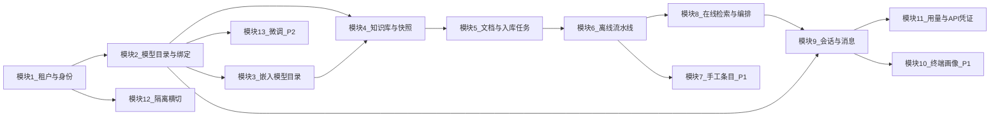

# 分模块开发计划

本文档从架构视角约定各模块的开发顺序与验收要点，与 [database_schema.md](database_schema.md) 中的表结构、功能对照、P0/P1/P2 优先级及向量/对象存储/Redis 约定一致。实现时以该数据设计为唯一参照，表名与字段以 `database_schema.md` 第 5 节及后续章节为准。

---

## 1. 总体说明

### 1.1 三条分析维度

| 维度 | 含义 |
|------|------|
| 业务逻辑链 | 用户或运营在界面上可完成的行为顺序，以及系统对外承诺的流程 |
| 数据逻辑链 | 请求进入后鉴权、上下文解析、落库、队列、异步任务、检索、写消息与计量的读写顺序 |
| 实体关系 | 关系型表、外键与租户隔离键；向量与缓存等非关系部分见 `database_schema.md` 第 6～8 节 |

### 1.2 与数据文档的对应关系

- 核心表定义与字段级应用场景：`database_schema.md` 第 5 节、第 3 节。
- 首期表优先级：`database_schema.md` 第 10 节（P0 / P1 / P2）。
- 一致性约束与删除租户等：`database_schema.md` 第 9 节。

### 1.3 模块依赖总览

### 1.4 建议迭代节奏

1. 模块 1 → 2 → 3 → 4 → 5：P0 垂直切片骨架。
2. 模块 6 → 8 → 9：RAG 主闭环。
3. 模块 7、10、11：P1 增强。
4. 模块 12：与各阶段并行加强。
5. 模块 13：P2，可独立分支。

### 1.5 离线/在线分工（当前约定）

- **`offline_service/embedding/`**：对外嵌入 HTTP（`embed_texts` / `embed_query_text`）及无远端时的确定性伪向量，与根目录 `config.py` 中 `EMBEDDING_*` 一致；供入库批量嵌入与在线检索查询向量共用。
- **`offline_service/indexing/`**：占位向量索引（内存字典、余弦检索、按点 id 与前缀增删），供文档与手工条目入库写入；在线检索读取同一模块以保证同进程内数据一致。
- **`offline_service/finetune/`**：微调占位执行等与离线任务相关的实现；异步入口可仍由 `workers.tasks` 薄封装调用。
- **`online_service/llm/`**：对外大模型补全 HTTP，与 `config.py` 中 `LLM_*` 一致。
- **`online_service/retrieval/`**：在线侧关键词子串命中、多路分数合并；编排入口为 `online_service.retrieve.run_retrieval`。
- **`online_service/chat_pipeline.py`**：多轮上下文与检索结果组装为模型消息、占位回复与调用 `online_service.llm`，无 Django 模型依赖；会话 HTTP/WebSocket 经 `app.apps.conversations.chat_turn` 调用。

---

## 2. 模块 1：租户、套餐与账号成员

**代码落点**：`app.apps.tenants`、用户与成员关系（可在 `tenants` 内或独立 `accounts` 包）、`app.middleware`。

### 2.1 业务逻辑链

套餐定义 → 租户注册与待审 → 审核开通 → 绑定套餐 → 成员邀请与角色 → 停用与归档。

### 2.2 数据逻辑链

请求进入后解析当前租户上下文；后续所有业务接口在已认证前提下携带或推导租户标识；套餐限额在读写知识库、对话、存储时读取 `plan` 与租户当前订阅关系。

### 2.3 实体关系

- `plan` 与 `tenant.plan_id`。
- `user_account` 与 `tenant_membership` 多对多，角色区分运营侧与租户内角色。
- `tenant.status` 驱动租户是否可登录、是否只读。

### 2.4 依赖模块

无前置业务模块；为模块 2、4、5、9、11 提供租户上下文。

### 2.5 建议验收点

- 可创建套餐与租户并完成审核状态流转。
- 成员仅能访问本租户数据（与模块 12 联调）。
- 迁移包含 `plan`、`tenant`、`user_account`、`tenant_membership` 对应模型。

---

## 3. 模块 2：模型目录与租户绑定

**代码落点**：`app.apps.models_registry`、`online_service/llm`（对外 HTTP 补全）。

### 3.1 业务逻辑链

平台维护基座模型目录 → 租户勾选默认可用模型 → 对话请求按绑定选择推理条目。

### 3.2 数据逻辑链

读 `base_model` 与 `tenant_model_binding`；对话写消息时写入 `chat_message.used_base_model_id`（在模块 9 落地）。

### 3.3 实体关系

- `base_model` 全局目录。
- `tenant_model_binding`：`tenant_id` + `base_model_id`，含默认与优先级。

### 3.4 依赖模块

模块 1（租户）；被模块 8、9、11 依赖。

### 3.5 建议验收点

- 基座模型可配置；租户绑定可多选并设默认。
- 项目根 `config.py` 中 LLM 相关占位与统一推理入口对齐（密钥不落库则走配置或环境覆盖）。

### 3.6 已落地接口与辅助能力

- HTTP 前缀：`/api/v1/inference/`。基座目录 `GET base-models` 无需会话。绑定 `GET` 与 `POST bindings`、以及 `PATCH` 与 `DELETE bindings/<绑定主键>` 需在请求头携带租户标识，且依赖已登录会话；列举绑定要求租户内任意角色，创建与修改、删除要求所有者或管理员。
- 绑定 JSON：`POST` 与 `PATCH` 可使用字段 `base_model_id`、`is_default`、`priority`、`enabled`（创建时 `base_model_id` 必填）。
- 解析默认基座模型主键：`app.apps.models_registry.resolver.resolve_default_base_model_id`，供后续对话编排复用。
- 对外 HTTP 调用大模型：`online_service.llm`，与根目录 `config.py` 中 LLM 相关项一致。

---

## 4. 模块 3：嵌入模型目录

**代码落点**：可与 `models_registry` 或 `knowledge_base` 同迭代；表 `embedding_model`。

### 4.1 业务逻辑链

平台配置嵌入模型与向量维度 → 创建知识库时选择嵌入版本。

### 4.2 数据逻辑链

`knowledge_base.embedding_model_id` 与分块向量维度一致；重建索引时按嵌入版本筛选与清理。

### 4.3 实体关系

`embedding_model` 被 `knowledge_base` 引用。

### 4.4 依赖模块

可与模块 2 后半并行；被模块 4、6 依赖。

### 4.5 建议验收点

- 嵌入模型表可维护；创建知识库时必须可选到合法嵌入配置。
- 与 `database_schema.md` 中向量维度校验思路一致。

### 4.6 已落地接口与辅助能力

- HTTP：`GET /api/v1/inference/embedding-models` 返回启用中的嵌入目录条目（无需会话）。平台增删改仍通过管理后台维护表数据。
- 校验启用中的嵌入主键：`app.apps.models_registry.resolver.resolve_active_embedding_model`，供创建知识库等流程复用。
- 对外 HTTP 向量请求：`offline_service.embedding`，与根目录 `config.py` 中嵌入服务端点与默认模型键一致；调用时使用目录中的 `provider`/`model_key` 拼出实际模型标识或由配置默认覆盖。

---

## 5. 模块 4：知识库与快照

**代码落点**：`app.apps.knowledge_base`。

### 5.1 业务逻辑链

创建知识库 → 启停 → 创建版本快照作为回滚点。

### 5.2 数据逻辑链

插入 `knowledge_base_snapshot` 后回写 `knowledge_base.current_snapshot_id`，避免与 `database_schema.md` 第 9 节所述循环依赖冲突。

### 5.3 实体关系

`knowledge_base` 与 `knowledge_base_snapshot` 一对多；当前指针在知识库上。

### 5.4 依赖模块

模块 1、3。

### 5.5 建议验收点

- 停用知识库后检索侧可识别（与模块 8 联调）。
- 快照创建与当前版本指针更新可重复执行且可追溯。

### 5.6 已落地接口与辅助能力

- HTTP 前缀：`/api/v1/`。`GET` 与 `POST knowledge-bases` 列出或创建知识库（创建时必填名称与嵌入目录主键；嵌入条目须为启用状态；冗余键为「提供方:模型键」形式；受套餐知识库数量上限约束）。`GET` 与 `PATCH knowledge-bases/<主键>` 查询详情（含最近快照列表）或改名称、描述、启停状态。`GET` 与 `POST knowledge-bases/<主键>/snapshots` 列出或新增快照（新增后自动将当前指针指向新快照）。`PATCH knowledge-bases/<主键>/current-snapshot` 将当前指针切换到同库下已有快照。上述接口均要求请求头携带租户标识与已登录会话；读操作为租户内任意角色，写操作为所有者或管理员。

---

## 6. 模块 5：文档与入库任务

**代码落点**：`app.apps.documents`、`workers/tasks` 入队入口。

### 6.1 业务逻辑链

上传或登记来源 → 对象存储落盘 → 创建 `ingestion_job` → 查询任务状态。

### 6.2 数据逻辑链

写 `document` 的存储键与解析、索引状态；异步任务更新 `ingestion_job` 与错误信息；失败可重试。

### 6.3 实体关系

`document` 归属 `knowledge_base`；`ingestion_job` 归属 `document`。

### 6.4 依赖模块

模块 1、4；依赖对象存储约定见 `database_schema.md` 第 7 节。

### 6.5 建议验收点

- 上传后元数据与存储路径符合租户隔离前缀。
- 任务状态机可读，与模块 6 对接。

### 6.6 已落地接口与辅助能力

- HTTP 前缀：`/api/v1/`。`GET` 与 `POST knowledge-bases/<知识库主键>/documents`：列举或登记文档；`POST` 支持 multipart 上传文件字段 `file`，或 `application/json` 且 `source_type` 为网址导入并携带来源地址；可选表单/JSON 字段指定快照主键（须属于该知识库），写入分块策略 JSON 中的目标快照键供流水线选用，否则入库结束时使用知识库当前指针。对象键形如 `tenants/{租户}/documents/{文档}/original`，桶名取自根配置（缺省为 `local`）；二进制写入根目录配置项 `LOCAL_OBJECT_STORAGE_ROOT` 对应本地目录。创建前校验知识库为启用状态及套餐文档总数上限。
- `GET documents/<文档主键>` 返回单条元数据；`GET documents/<文档主键>/ingestion-jobs` 列出该文档的入库任务；`GET ingestion-jobs/<任务主键>` 返回单条任务。读接口需租户头与登录会话，角色规则与知识库接口一致；写登记仅所有者或管理员。
- 登记后为每条文档创建一条全链路类型的入库任务并**同步**调用 `offline_service.ingestion`：含分块、嵌入与占位向量库及文本块落库；成功则文档解析与索引状态为就绪，快照字段规则同前；失败可自任务与文档错误字段观测。异步队列可改为调用 `workers.tasks.run_ingestion_job_task`。

---

## 7. 模块 6：离线处理流水线

**代码落点**：`offline_service`（含 `offline_service/indexing` 占位向量索引、`offline_service/embedding`）、`workers`（异步入口薄封装）。

### 7.1 业务逻辑链

拉取原文 → 清洗与解析 → 分块 → 嵌入 → 写向量索引 → 更新 `document_chunk` 与文档索引状态。

### 7.2 数据逻辑链

由 `ingestion_job` 驱动状态；`document_chunk` 与向量点 id 对齐；与 `database_schema.md` 第 9 节最终一致要求一致。

### 7.3 实体关系

`document_chunk`；向量载荷字段见 `database_schema.md` 第 6 节。

### 7.4 依赖模块

模块 3、5；输出给模块 8。

### 7.5 建议验收点

- 单条文档可走通解析至索引就绪或失败可观测。
- 向量写入带 `tenant_id` 与知识库范围。

### 7.6 已落地接口与辅助能力

- 入口：`offline_service.ingestion.run_ingestion_job` 由文档登记处的同步调用触发；`workers.tasks.run_ingestion_job_task` 供后续接队列时复用同一实现。
- 流程：自本地对象根按存储键读取字节并解码为文本；按根配置分块尺寸与重叠分块；未配置嵌入服务端点则使用与文本内容绑定的确定性伪向量（维度取自知识库关联的嵌入目录或默认）；已配置则按 OpenAI 兼容接口分批请求嵌入；将向量与元数据（租户、知识库、快照、文档、块序号、文本摘要、`source_kind` 等）写入 `offline_service.indexing.memory_store` 进程内字典（可视为占位向量库）；落 `document_chunk` 行并更新任务进度与文档解析、索引状态；失败时写入任务错误与文档最近错误字段。重跑前删除该文档旧块并从占位向量库按点 id 前缀清理。
- 根配置项：`INGEST_CHUNK_SIZE`、`INGEST_CHUNK_OVERLAP`、`INGEST_EMBED_BATCH_SIZE`；嵌入与向量库仍与既有 `EMBEDDING_*`、`VECTOR_DB_*` 占位项并存，当前向量侧以内存实现为主。

---

## 8. 模块 7：手工知识条目（P1）

**代码落点**：`app.apps.knowledge_base` 或独立条目子模块、`offline_service` 复用分块与向量。

### 8.1 业务逻辑链

录入与编辑条目 → 发布 → 分块 → 向量化。

### 8.2 数据逻辑链

与文档链路类似，实体换为 `knowledge_entry` 与 `knowledge_entry_chunk`。

### 8.3 实体关系

`knowledge_entry` 归属知识库；块表与向量 `source_kind` 区分文档块与条目块（见数据文档向量节）。

### 8.4 依赖模块

模块 4、6。

### 8.5 建议验收点

- 发布后检索可命中条目块；引用溯源可定位到条目块主键。

### 8.6 已落地接口与辅助能力

- HTTP：`GET`/`POST .../knowledge-bases/<知识库主键>/entries` 列举或新建条目（正文必填；状态可为草稿、已发布、已归档）；`GET`/`PATCH`/`DELETE .../entries/<条目主键>`。已发布时触发 `offline_service.knowledge_entry_ingestion`：分块、嵌入、占位向量库点标识前缀 `v1e:`，块表 `source_kind` 为手工条目块；从已发布改为其他状态时清理块与向量占位。须租户头与登录；读为租户内任意角色，写为所有者或管理员；知识库须启用。

---

## 9. 模块 8：在线检索与编排

**代码落点**：`online_service`（含 `online_service/retrieval`、`online_service/llm`、`online_service/chat_pipeline`）；热点缓存可选 Redis（见 `database_schema.md` 第 8 节）。

### 9.1 业务逻辑链

意图与查询改写 → 向量召回 → 混合检索 → 重排 → 组装引用列表供生成使用。

### 9.2 数据逻辑链

检索范围限定租户与启用知识库；结果写入 `chat_message.pipeline_trace`、`rewritten_query`、`retrieval_refs`（模块 9 持久化）。

### 9.3 实体关系

引用锚点依赖 `document_chunk`、`knowledge_entry_chunk` 主键。

### 9.4 依赖模块

模块 4、6（及 7 若启用条目）；被模块 9 调用。

### 9.5 建议验收点

- 无知识时不捏造；有引用时可回溯到块与文档。
- 热点检索可走 Redis，键模式见 `database_schema.md` 第 8 节。

### 9.6 已落地接口与辅助能力

- HTTP：`POST /api/v1/knowledge-bases/<知识库主键>/retrieve`，JSON 体含查询字符串，可选 `top_k` 与 `snapshot_id`（按快照过滤向量占位库中的元数据）。请求头需租户标识与已登录会话，租户内只读角色即可。知识库须为启用状态。
- 编排：`online_service.retrieve.run_retrieval` 对查询做嵌入（无远端嵌入服务时与入库一致的确定性伪向量）、在 `offline_service.indexing` 上按租户与知识库范围做余弦召回，并与 `online_service.retrieval.keyword_search` 中**文档块与手工条目块**的子串命中一并加权合并（`online_service.retrieval.rerank`），返回项区分 `source_kind`（文档块或手工条目块）及对应文档或条目主键；`pipeline_trace` 含向量命中数与两类关键词命中数；`rewritten_query` 暂空。会话落库与 `chat_message.retrieval_refs` 由模块 9 衔接。
- 根配置：`RETRIEVAL_TOP_K` 为默认返回条数上限。

---

## 10. 模块 9：会话、消息与记忆

**代码落点**：`app.apps.conversations`、`app.asgi`、`online_service/streaming`。

### 10.1 业务逻辑链

创建会话 → 多轮消息 → 助手回复带引用 → 可选流式输出。

### 10.2 数据逻辑链

写 `conversation` 与 `chat_message`；短期上下文可走 Redis；摘要写 `conversation.summary`；长期记忆与 `conversation_memory_chunk` 及向量见 P1。

### 10.3 实体关系

`conversation` 可选关联 `end_user_profile`；`chat_message.used_base_model_id` 指向基座。

### 10.4 依赖模块

模块 1、2、8；与模块 10、11 协同。

### 10.5 建议验收点

- 一轮对话可端到端调用检索与推理并落库消息与 Token 字段。
- 流式与 HTTP 共用同一套持久化语义。

### 10.6 已落地接口与辅助能力

- WebSocket：`/ws/v1/chat?tenant_id=<租户主键>`，须携带与 HTTP 登录相同的会话 Cookie；连接后发送 JSON：`{"action":"message","content":"用户正文","conversation_id":可选,"knowledge_base_id":可选}`。服务端依次推送 `ready`（含会话主键）、多段 `delta`（助手正文分片）、`done`（用户消息与助手消息主键）；错误时推送 `type=error` 与 `code`。业务实现在 `app.apps.conversations.chat_turn.process_chat_turn`（内部调用 `online_service.chat_pipeline.run_assistant_generation` 与 `online_service.retrieve.run_retrieval`）：可选调用在线检索、按租户默认基座绑定解析模型键并调用语言模型；未配置语言模型接口时使用占位文案（若有检索结果则拼接片段摘要）；助手消息写入 `retrieval_refs`、`pipeline_trace`、`rewritten_query` 占位、用量字段及 `used_base_model` 外键。
- ASGI：`daphne` 与 `channels` 已加入依赖与 `INSTALLED_APPS`，`app.asgi` 使用 `ProtocolTypeRouter` 挂载 HTTP 与 `SessionMiddlewareStack` 包裹的 WebSocket 路由；默认进程内 `InMemoryChannelLayer`。生产需使用支持 ASGI 的进程管理并视情况替换 Channel 层。
- 运行：需 `pip install` 更新依赖后使用 ASGI 服务器（如 `daphne`）启动以启用 WebSocket；纯 `runserver` 对 WebSocket 支持因环境而异，以 ASGI 为准。

---

## 11. 模块 10：终端用户画像（P1）

**代码落点**：`app.apps.conversations` 或独立轻量应用。

### 11.1 业务逻辑链

外部用户标识映射 → 维护偏好与标签 → 会话绑定画像。

### 11.2 数据逻辑链

单租户内读写 `end_user_profile`；与 `conversation.end_user_profile_id` 同租户一致。

### 11.3 实体关系

`end_user_profile`：`tenant_id` + `external_user_key` 唯一。

### 11.4 依赖模块

模块 1、9。

### 11.5 建议验收点

- 匿名会话可空画像；绑定后会话可读取偏好注入编排（与模块 8 策略可选联调）。

### 11.6 已落地接口与辅助能力

- HTTP：`GET`/`POST /api/v1/end-user-profiles` 列举或新建画像（外部用户标识必填，租户内唯一；可选展示名与 JSON 偏好、标签）；`GET`/`PATCH`/`DELETE /api/v1/end-user-profiles/<主键>` 查询、更新或删除。`PATCH /api/v1/conversations/<会话主键>/profile` 绑定或解除绑定画像（请求体为画像主键或空以清空）。须请求头租户与登录会话；列举与查询为租户内任意角色，写操作为所有者或管理员。

---

## 12. 模块 11：用量与 API 凭证

**代码落点**：`app.apps.usage`、网关鉴权与 `tenant_api_credential`。

### 12.1 业务逻辑链

对话轮次与 Token 上报 → 日汇总 → 与套餐限额比对；开放 API 使用密钥访问。

### 12.2 数据逻辑链

写 `usage_event`；聚合 `usage_daily_aggregate`；网关解析 `tenant_api_credential` 得到租户。

### 12.3 实体关系

`usage_event` 可选关联会话或文档；密钥仅存哈希。

### 12.4 依赖模块

模块 1、5、9。

### 12.5 建议验收点

- 对话与存储可产生计量事件；超额策略可先记录再限制。
- API Key 签发与吊销可查。

### 12.6 已落地接口与辅助能力

- HTTP：`GET`/`POST /api/v1/api-credentials` 在已登录且请求头携带租户前提下，由所有者或管理员列出或创建密钥（创建响应中一次性返回 `secret_once`，之后仅能通过 `key_id` 识别）；`PATCH /api/v1/api-credentials/<主键>` 将状态置为吊销。
- 网关：`Authorization: Bearer sk_<32位十六进制>_<密钥>` 或 `X-API-Key` 携带同格式串时，`ApiKeyTenantMiddleware` 在校验通过后设置租户上下文（早于按 `X-Tenant-ID` 解析的中间件）；密钥校验与 `last_used_at` 更新见 `app.apps.usage.api_auth`。
- 计量：对话回合成功落库后，`record_chat_usage` 写入 `usage_event`（轮次与可选提示、生成 Token）并递增当日 `usage_daily_aggregate`；模型定义在 `app.apps.usage`，租户 API 凭证表模型在 `app.apps.api`（与既有迁移一致）。

---

## 13. 模块 12：隔离策略与横切

**代码落点**：`app.apps.isolation`、`app.middleware`。

### 13.1 业务逻辑链

任意业务接口不允许跨租户读取或写入他租户数据。

### 13.2 数据逻辑链

ORM 查询集统一带租户条件；管理端与租户端路由分离；服务层入参显式传递租户上下文。

### 13.3 实体关系

无新增表；约束落在各表 `tenant_id` 与 `database_schema.md` 第 4 节设计约定。

### 13.4 依赖模块

与模块 1 同步启动，随各模块扩展测试用例。

### 13.5 建议验收点

- 自动化或手工用例覆盖越权访问被拒绝。
- 与 `database_schema.md` 第 9 节删除与归档策略在实现阶段对齐。

### 13.6 已落地接口与辅助能力

- 中间件：`TenantRequiredMiddleware` 置于租户解析之后，对 `/api/v1/` 下路径在未解析到租户时返回 400；白名单见 `app.apps.isolation.exempt.is_tenant_optional_path`（租户注册/登录/登出/当前用户、内部审核路径、推理目录只读接口等）。
- 查询辅助：`app.apps.isolation.query.for_tenant` 按模型是否含 `tenant_id` 或 `tenant` 外键过滤查询集，供服务层统一收窄范围。

---

## 14. 模块 13：微调流水线（P2）

**代码落点**：`app.apps.models_registry` 扩展、`workers`、对象存储。

### 14.1 业务逻辑链

上传训练集 → 排队训练 → 日志与指标落对象存储 → 版本与血缘登记。

### 14.2 数据逻辑链

大文件只存存储键；状态更新 `fine_tune_job`。

### 14.3 实体关系

`fine_tune_job` 关联 `base_model` 与可选 `parent_fine_tune_job_id`。

### 14.4 依赖模块

模块 2；真训练引擎可后置。

### 14.5 建议验收点

- 表与状态机可用；数据集与日志路径符合 `database_schema.md` 第 7 节。

### 14.6 已落地接口与辅助能力

- HTTP（前缀同推理模块 `/api/v1/inference/`）：`GET`/`POST fine-tune-jobs` 列出或创建任务（草稿；必填数据集存储键；可选基座模型、父任务、版本标签）；`GET`/`PATCH fine-tune-jobs/<主键>` 查询或将状态置为取消（草稿、排队或运行中可取消）；`POST fine-tune-jobs/<主键>/run` 自草稿进入排队并**同步**执行占位流水线至成功。占位逻辑见 `offline_service.finetune.placeholder`（`workers.tasks.finetune_placeholder` 仅再导出供队列复用），写入占位日志键、产出引用与指标 JSON。
- 真训练与对象存储实际上传可后续替换占位实现。

---

## 15. 文档修订

| 版本 | 日期 | 说明 |
|------|------|------|
| 1.0 | 2026-04-03 | 首版，与分模块计划及 database_schema 对齐 |
